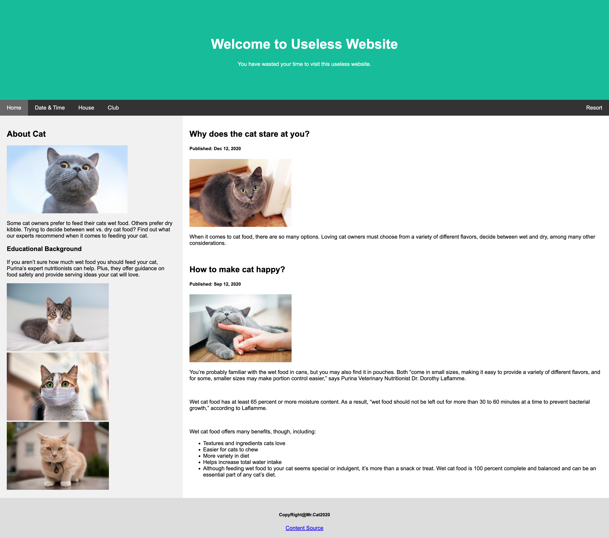
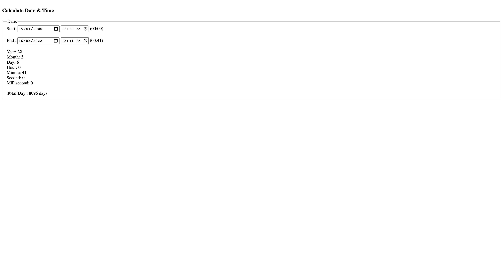
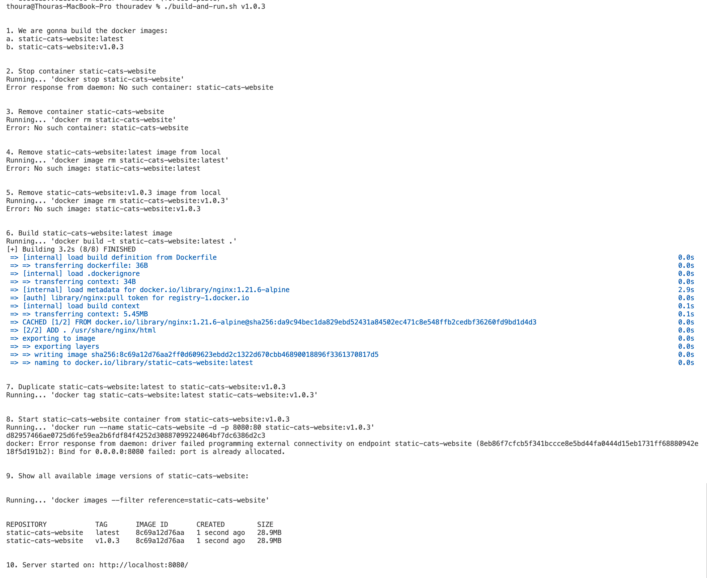

# Static Cats Website with NGINX Docker

Perpuse => Learn Docker & NGINX

Visit me: https://thouradev.com/

## Home Page:

## Calculate DateTime Page:

# Installation

Supose that you have docker installed on you local. 
Then, you just one command to launch the static webiste on docker. 

1. Clone the project
2. Make sure port **8080** is available on your local
3. Run `./build-and-run.sh v1.0.3`

You will see the similar result as shown below:

Then, you can access [http://localhost:8080/](http://localhost:8080/). 

Done...

